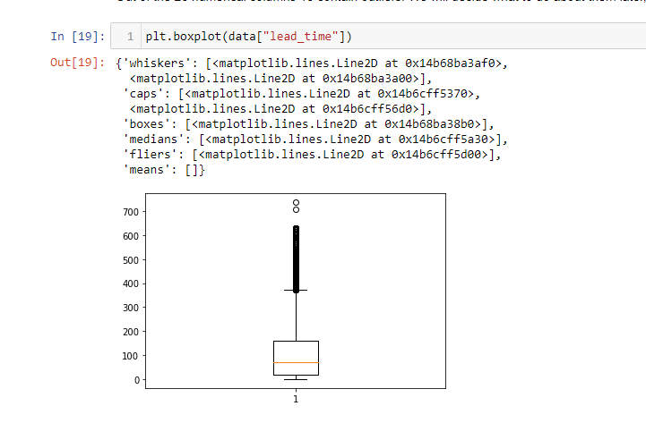
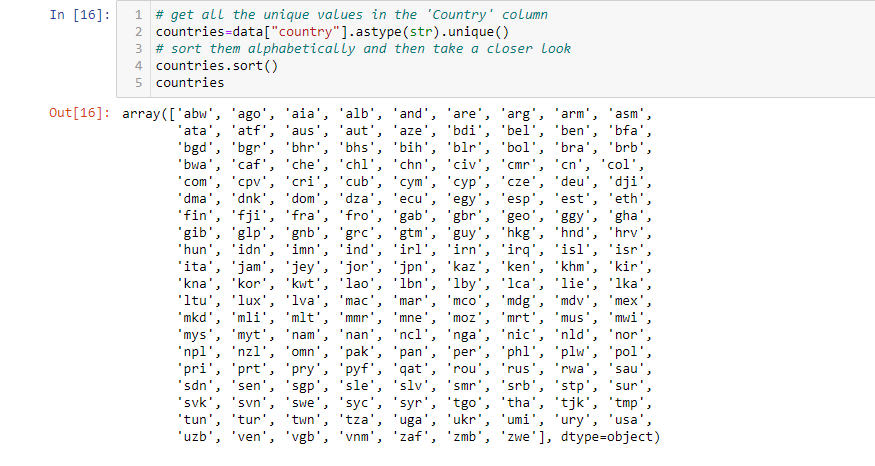
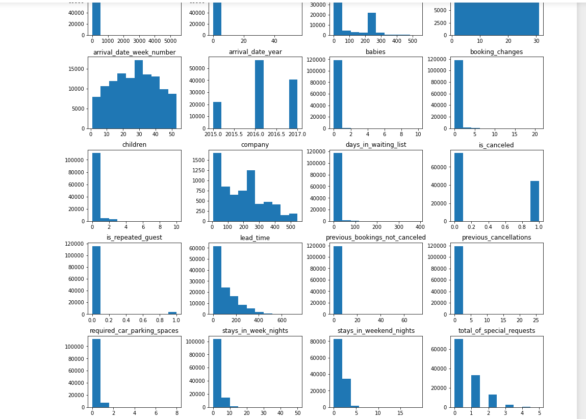

# Hotel-Booking

## Table of contents
* [General info](#general-infos)
* [Screenshots](#screenshots)
* [Technologies](#technologies)
* [Findings](#findings)
* [Status](#status)
* [Contact](#contact)

## General info
This is a data cleaning project, the objective is to detect, correct or remove inaccurate records from hotel booking dataset to insure data quality before further analysis. The dataset has 119390 observations and 32 variables.

## Screenshots

## Technologies
Programming Language: Python
Packages:
* pandas
* numpy
* pandas_profiling
* matplotlib.pyplot 
* seaborn as sns
* statistics
* sklearn

## Findings
* Missing data
* Single value
* Duplicate data
* Invalid and contaminated data
* Inconsistence data
* Outliers

## Status
Project is completed

## Contact
Can contact me via my mail. [missewoudiane@gmail.com](missewoudiane@gmail.com) 
